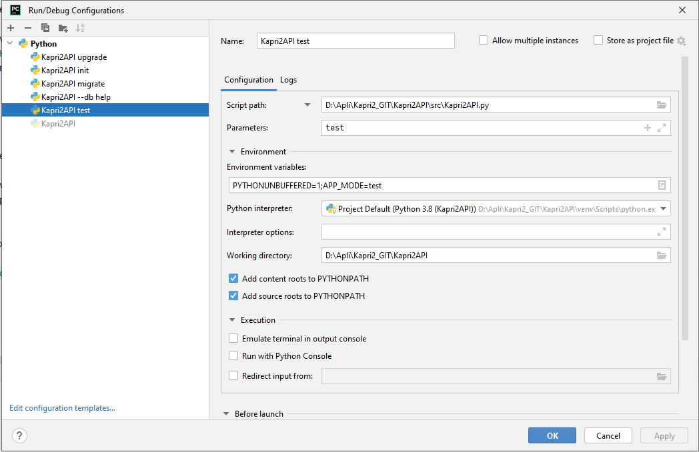
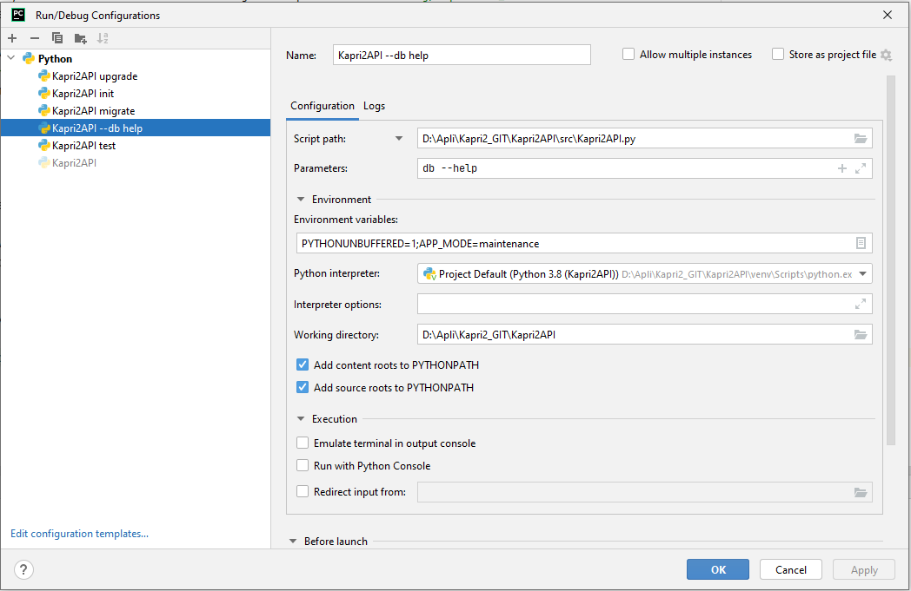
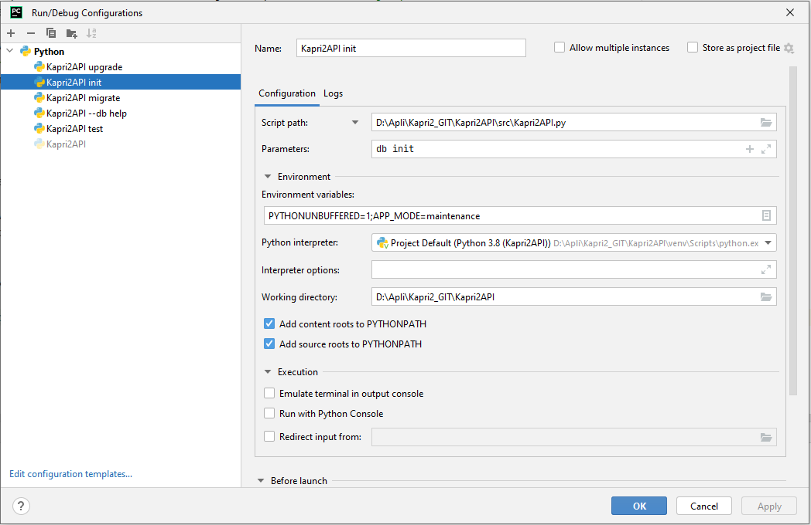
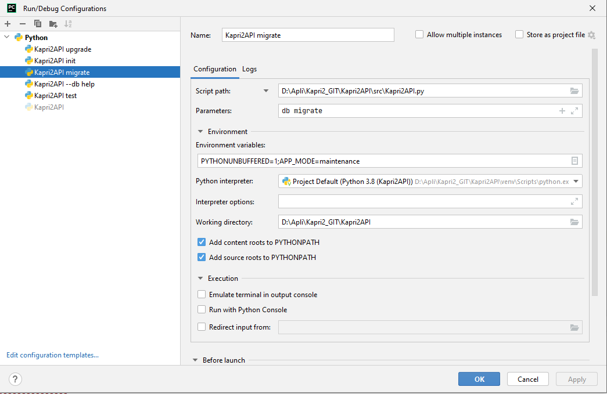
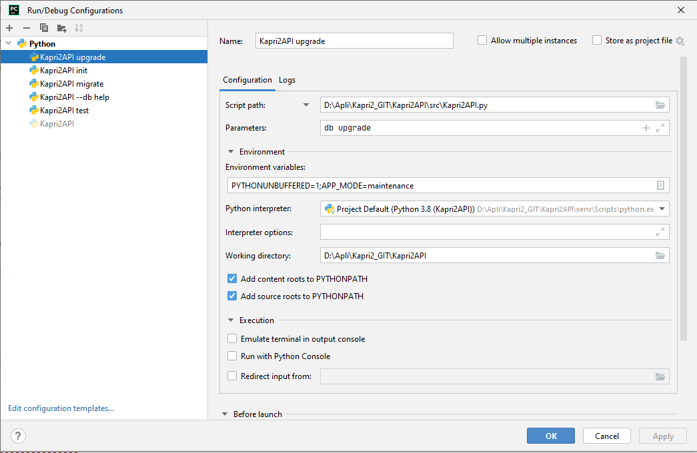
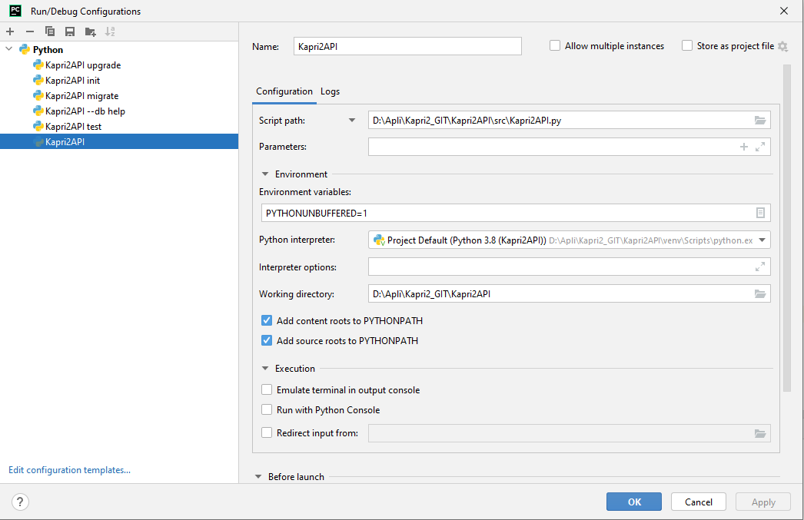

# Run/Debug Configurations

## Configuració de test

Automàticament executa els tests del directori `src\tests`.
Consultar `README.md` en referència a `APP_MODE=test` per més informació.

## Configuracions de manteniment
Aquestes configuracions fan servir les comandes `db` de l'aplicació Flask.

### Maintenance: db help
La primera d'elles mostra l'ajuda de la comanda `db`:

### Maintenance: db init
Aquesta comanda inicialitza el repositori. Crea per primer cop el directori migrations.
Per reproduir la inicialització amb posterioritat cal:
* Esborrar la base de dades.
* Esborrar el directori migrations.

### Maintenance: db migrate
Aquesta comanda afegeix un nou arxiu de versió a migrations/version.
Recull els canvis fets a `db_models.py`
Per fer servir la comanda cal:
* Esborrar la base de dades.
* Executar la comanda upgrade, per crear la base de dades i deixar-la en l'estat de la darrera versió migrada.
* Executar la comanda migrate.
* Editar l'arxiu de versions i afegir-hi les comandes personalitzades a l'apartat `# ### Customized commands ###`

### Maintenance: db upgrade
Serveix per actualitzar la base de dades a la darrera versió migrada.

Consultar `README.md` en referència a `APP_MODE=maintenance` per més informació.

## Configuració de desenvolupament/debug
Aquesta configuració executa el servei en mode normal.

Consultar `README.md` en referència a `APP_MODE` no definida o `APP_MODE=normal` per més informació.